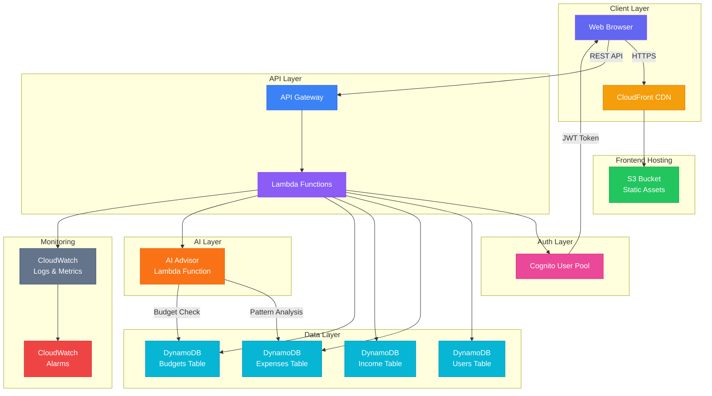

# AWS Architecture — FinTrack AI

## Architecture Diagram

## DynamoDB Table Schemas

### Users Table
| Attribute | Type | Key |
|-----------|------|-----|
| id | String | Partition Key |
| email | String | GSI Partition |
| name | String | — |
| password | String | — |
| currency | String | — |
| created_at | String | — |

### Expenses Table
| Attribute | Type | Key |
|-----------|------|-----|
| id | String | Partition Key |
| user_id | String | GSI Partition |
| date | String | GSI Sort Key |
| amount | Number | — |
| category | String | — |
| description | String | — |

### Income Table
| Attribute | Type | Key |
|-----------|------|-----|
| id | String | Partition Key |
| user_id | String | GSI Partition |
| date | String | GSI Sort Key |
| amount | Number | — |
| source | String | — |

### Budgets Table
| Attribute | Type | Key |
|-----------|------|-----|
| id | String | Partition Key |
| user_id | String | GSI Partition |
| month | String | — |
| category | String | — |
| amount | Number | — |

## Data Flow

1. **User Auth**: Browser → API Gateway → Cognito → JWT Token → Browser
2. **Add Expense**: Browser → API Gateway → Lambda → DynamoDB → Response
3. **AI Analytics**: Browser → API Gateway → Lambda → Read DynamoDB → Pattern Analysis → Recommendations
4. **Dashboard**: Browser → CloudFront → S3 (static) + API Gateway → Lambda → DynamoDB
